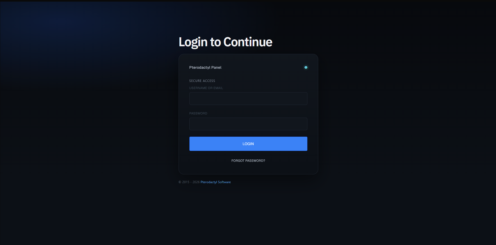
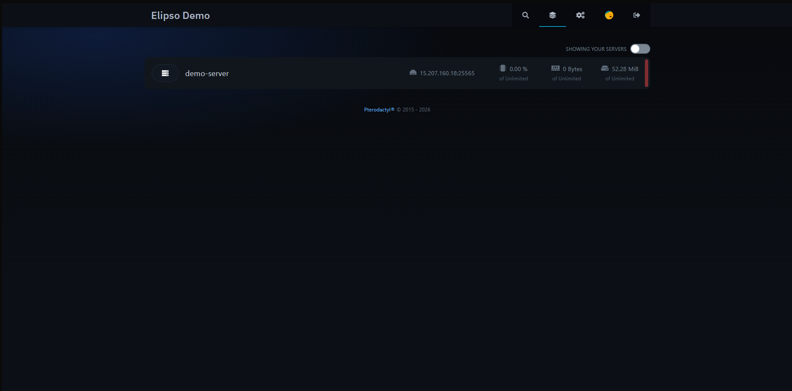
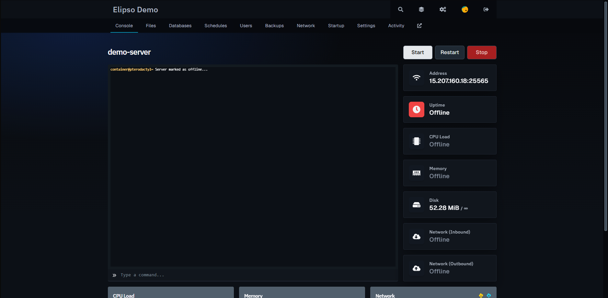
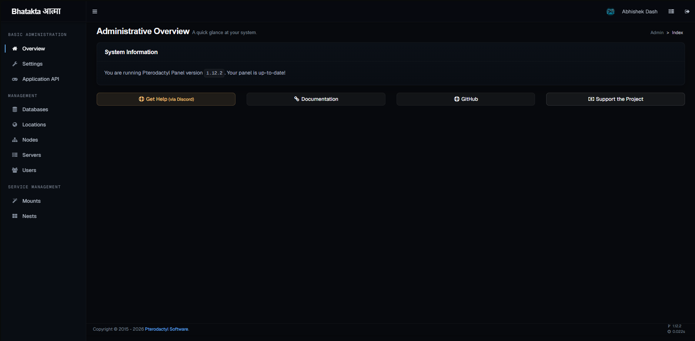

# Elipso — Vercel Dark Theme for Pterodactyl Panel

A Vercel-inspired dark theme for Pterodactyl Panel.






## Quick Install

```bash
curl -sL https://raw.githubusercontent.com/instax-dutta/elipso-theme/main/install.sh -o /tmp/elipso.sh && sudo bash /tmp/elipso.sh
```

## Features

- Near-black canvas (#0a0a0a) with white ink (#ededed)
- Geist & Geist Mono typography
- Mesh gradient on auth pages
- Dark themed React client + Admin panel

## After Install

Clear browser cache or use incognito mode to see the theme.

## Uninstall

Restore from backup at `/var/www/elipso-backup-YYYYMMDD-HHMMSS/`

## Acknowledgments

Special thanks to [getdesign.md](https://getdesign.md) for providing the Vercel-inspired design assets that served as the foundation for this theme. Their work has been instrumental in bringing this project to life.

## License

MIT
